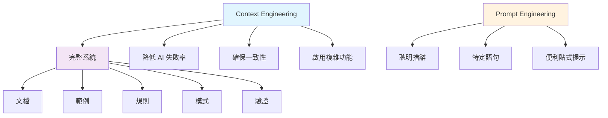
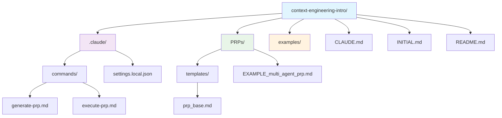
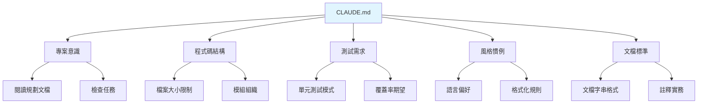
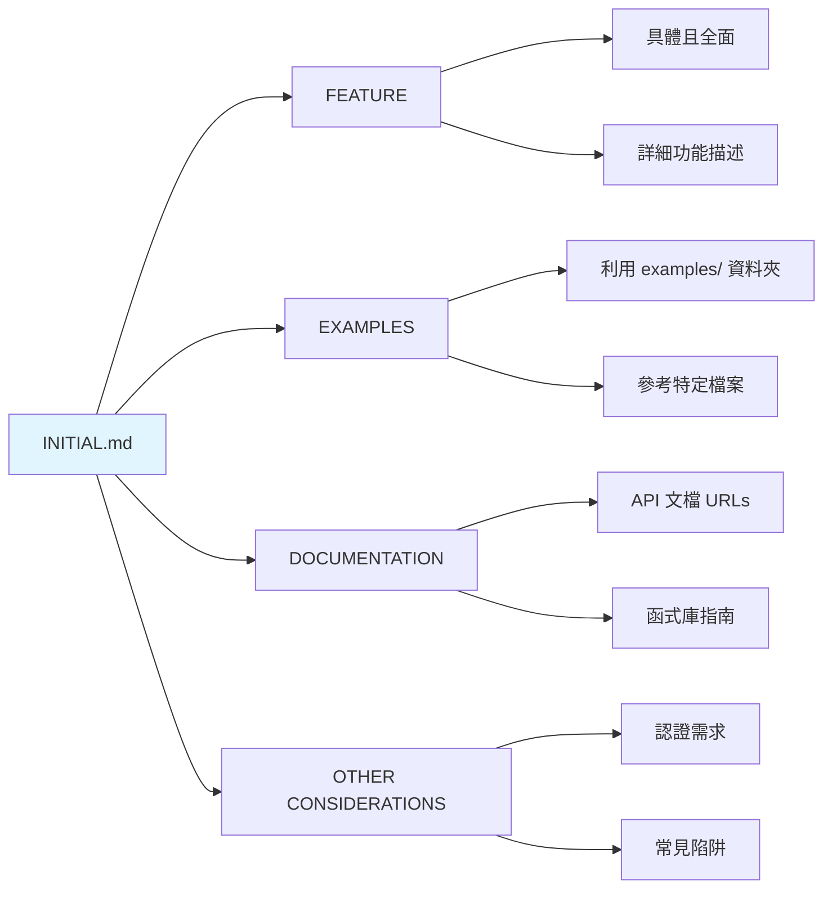
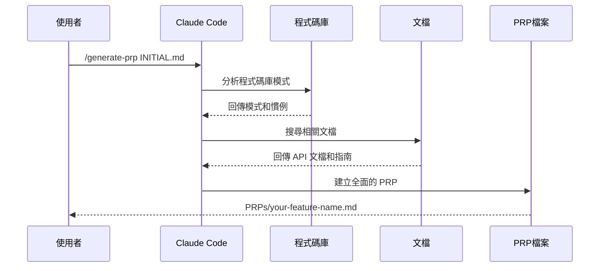
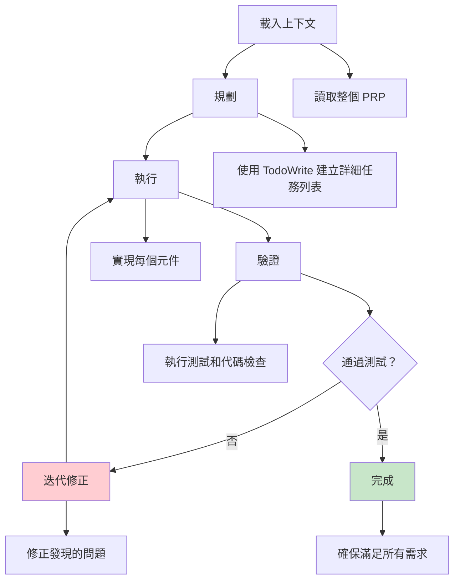
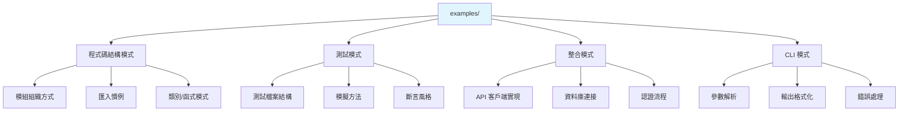
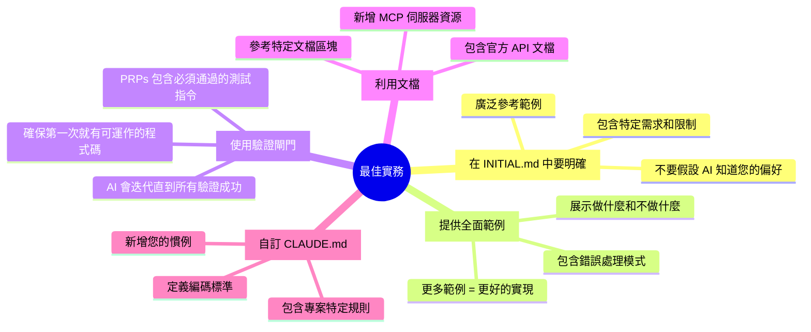

# Context Engineering 模板

一個全面的模板，幫助您開始使用 Context Engineering - 為 AI 程式設計助手設計上下文的學科，使它們擁有端到端完成工作所需的資訊。

> **Context Engineering 比 prompt engineering 好 10 倍，比直覺式編程好 100 倍。**



## 🚀 快速開始

```bash
# 1. 複製此模板
git clone https://github.com/coleam00/Context-Engineering-Intro.git
cd Context-Engineering-Intro

# 2. 設定您的專案規則（可選 - 已提供模板）
# 編輯 GEMINI.md 以新增專案特定的指導原則

# 3. 新增範例（強烈建議）
# 在 examples/ 資料夾中放置相關程式碼範例

# 4. 建立您的初始功能需求
# 編輯 INITIAL.md 設定功能需求

# 5. 生成全面的 PRP（產品需求提示）
# 在 Claude Code 中執行：
/generate-prp INITIAL.md

# 6. 執行 PRP 來實現您的功能
# 在 Claude Code 中執行：
/execute-prp PRPs/your-feature-name.md
```

## 📚 目錄

- [什麼是 Context Engineering？](#什麼是-context-engineering)
- [模板結構](#模板結構)
- [逐步指南](#逐步指南)
- [撰寫有效的 INITIAL.md 檔案](#撰寫有效的-initialmd-檔案)
- [PRP 工作流程](#prp-工作流程)
- [有效使用範例](#有效使用範例)
- [最佳實務](#最佳實務)

## 什麼是 Context Engineering？

Context Engineering 代表從傳統 prompt engineering 的典範轉移：


### Prompt Engineering vs Context Engineering

**Prompt Engineering：**
- 專注於聰明的措辭和特定語句
- 僅限於如何描述任務
- 像是給某人一張便利貼

**Context Engineering：**
- 提供全面上下文的完整系統
- 包含文檔、範例、規則、模式和驗證
- 像是撰寫包含所有細節的完整劇本

### 為什麼 Context Engineering 重要

1. **降低 AI 失敗率**：大多數代理失敗不是模型失敗 - 而是上下文失敗
2. **確保一致性**：AI 遵循您的專案模式和慣例
3. **啟用複雜功能**：AI 可以用適當的上下文處理多步驟實現
4. **自我修正**：驗證循環允許 AI 修正自己的錯誤

## 模板結構



```
context-engineering-intro/
├── .gemini/
│   ├── commands/
│   │   ├── generate-prp.md    # 生成全面的 PRPs
│   │   └── execute-prp.md     # 執行 PRPs 來實現功能
│   └── settings.local.json    # Gemini Code 權限
├── PRPs/
│   ├── templates/
│   │   └── prp_base.md       # PRPs 的基礎模板
│   └── EXAMPLE_multi_agent_prp.md  # 完整 PRP 範例
├── examples/                  # 您的程式碼範例（關鍵！）
├── GEMINI.md                 # AI 助手的全域規則
├── INITIAL.md               # 功能需求模板
├── INITIAL_EXAMPLE.md       # 功能需求範例
└── README.md                # 此檔案
```

此模板不專注於與上下文工程結合的 RAG 和工具，因為我很快會有更多內容。;)

## 逐步指南

### 1. 設定全域規則（CLAUDE.md）



`CLAUDE.md` 檔案包含 AI 助手在每次對話中都會遵循的專案範圍規則。模板包含：

- **專案意識**：閱讀規劃文檔、檢查任務
- **程式碼結構**：檔案大小限制、模組組織
- **測試需求**：單元測試模式、覆蓋率期望
- **風格慣例**：語言偏好、格式化規則
- **文檔標準**：文檔字串格式、註釋實務

**您可以直接使用提供的模板，或為您的專案自訂它。**

### 2. 建立您的初始功能需求

編輯 `INITIAL.md` 來描述您想要建構的內容：

```markdown
## FEATURE:
[描述您想要建構的內容 - 對功能和需求要具體]

## EXAMPLES:
[列出 examples/ 資料夾中的任何範例檔案並解釋應如何使用]

## DOCUMENTATION:
[包含相關文檔、API 或 MCP 伺服器資源的連結]

## OTHER CONSIDERATIONS:
[提及任何陷阱、特定需求或 AI 助手常忽略的事項]
```

**查看 `INITIAL_EXAMPLE.md` 獲得完整範例。**

### 3. 生成 PRP

```mermaid
flowchart TD
    A[INITIAL.md] --> B[/generate-prp]
    B --> C[研究階段]
    B --> D[文檔收集]
    B --> E[藍圖建立]
    B --> F[品質檢查]
    
    C --> C1[分析程式碼庫模式]
    C --> C2[搜尋類似實現]
    C --> C3[識別慣例]
    
    D --> D1[取得相關 API 文檔]
    D --> D2[包含函式庫文檔]
    D --> D3[新增陷阱和怪癖]
    
    E --> E1[建立逐步實現計劃]
    E --> E2[包含驗證閘門]
    E --> E3[新增測試需求]
    
    F --> F1[信心等級評分 1-10]
    F --> F2[確保包含所有上下文]
    
    F --> G[PRPs/your-feature-name.md]
    
    style A fill:#fff3e0
    style G fill:#e8f5e8
```

PRPs（產品需求提示）是包含以下內容的全面實現藍圖：

- 完整的上下文和文檔
- 帶驗證的實現步驟  
- 錯誤處理模式
- 測試需求

它們類似於 PRDs（產品需求文檔），但更專門用於指導 AI 程式設計助手。

在 Gemini CLI 中執行：
```bash
/generate-prp INITIAL.md
```

**注意：** 斜線指令是在 `.gemini/commands/` 中定義的自訂指令。您可以查看它們的實現：
- `.gemini/commands/generate-prp.md` - 查看如何研究和建立 PRPs
- `.gemini/commands/execute-prp.md` - 查看如何從 PRPs 實現功能

這些指令中的 `$ARGUMENTS` 變數接收您在指令名稱後傳遞的任何內容（例如 `INITIAL.md` 或 `PRPs/your-feature.md`）。

此指令將：
1. 閱讀您的功能需求
2. 研究程式碼庫的模式
3. 搜尋相關文檔
4. 在 `PRPs/your-feature-name.md` 中建立全面的 PRP

### 4. 執行 PRP

```mermaid
flowchart TD
    A[PRPs/your-feature-name.md] --> B[/execute-prp]
    B --> C[載入上下文]
    C --> D[建立計劃]
    D --> E[執行實現]
    E --> F[驗證]
    F --> G[迭代修正]
    G --> H[完成]
    
    C --> C1[讀取整個 PRP]
    D --> D1[使用 TodoWrite 建立詳細任務列表]
    E --> E1[實現每個元件]
    F --> F1[執行測試和代碼檢查]
    G --> G1[修正發現的任何問題]
    H --> H1[確保滿足所有需求]
    
    style A fill:#e8f5e8
    style H fill:#c8e6c9
```

生成後，執行 PRP 來實現您的功能：

```bash
/execute-prp PRPs/your-feature-name.md
```

AI 程式設計助手將：
1. 從 PRP 讀取所有上下文
2. 建立詳細的實現計劃
3. 執行每個步驟並進行驗證
4. 執行測試並修正任何問題
5. 確保滿足所有成功標準

## 撰寫有效的 INITIAL.md 檔案

### 關鍵區塊說明



**FEATURE**：要具體且全面
- ❌ "建立網頁爬蟲"
- ✅ "使用 BeautifulSoup 建立異步網頁爬蟲，從電商網站擷取產品資料，處理速率限制，並將結果儲存在 PostgreSQL 中"

**EXAMPLES**：利用 examples/ 資料夾
- 在 `examples/` 中放置相關程式碼模式
- 參考特定檔案和要遵循的模式
- 解釋應該模仿哪些方面

**DOCUMENTATION**：包含所有相關資源
- API 文檔 URLs
- 函式庫指南
- MCP 伺服器文檔
- 資料庫結構描述

**OTHER CONSIDERATIONS**：捕捉重要細節
- 認證需求
- 速率限制或配額
- 常見陷阱
- 效能需求

## PRP 工作流程

### /generate-prp 如何運作



指令遵循此過程：

1. **研究階段**
   - 分析您的程式碼庫模式
   - 搜尋類似實現
   - 識別要遵循的慣例

2. **文檔收集**
   - 取得相關 API 文檔
   - 包含函式庫文檔
   - 新增陷阱和怪癖

3. **藍圖建立**
   - 建立逐步實現計劃
   - 包含驗證閘門
   - 新增測試需求

4. **品質檢查**
   - 信心等級評分（1-10）
   - 確保包含所有上下文

### /execute-prp 如何運作



1. **載入上下文**：讀取整個 PRP
2. **規劃**：使用 TodoWrite 建立詳細任務列表
3. **執行**：實現每個元件
4. **驗證**：執行測試和代碼檢查
5. **迭代**：修正發現的任何問題
6. **完成**：確保滿足所有需求

查看 `PRPs/EXAMPLE_multi_agent_prp.md` 獲得生成內容的完整範例。

## 有效使用範例

`examples/` 資料夾對成功**至關重要**。當 AI 程式設計助手能看到要遵循的模式時，表現會好得多。



### 在範例中包含什麼

1. **程式碼結構模式**  
   - 您如何組織模組
   - 匯入慣例
   - 類別/函式模式

2. **測試模式**
   - 測試檔案結構
   - 模擬方法
   - 斷言風格

3. **整合模式**
   - API 客戶端實現
   - 資料庫連接
   - 認證流程

4. **CLI 模式**
   - 參數解析
   - 輸出格式化
   - 錯誤處理

### 範例結構

```
examples/
├── README.md           # 解釋每個範例示範什麼
├── cli.py             # CLI 實現模式
├── agent/             # Agent 架構模式
│   ├── agent.py      # Agent 建立模式
│   ├── tools.py      # 工具實現模式
│   └── providers.py  # 多提供者模式
└── tests/            # 測試模式
    ├── test_agent.py # 單元測試模式
    └── conftest.py   # Pytest 配置
```

## 最佳實務



### 1. 在 INITIAL.md 中要明確
- 不要假設 AI 知道您的偏好
- 包含特定需求和限制
- 廣泛參考範例

### 2. 提供全面範例
- 更多範例 = 更好的實現
- 展示做什麼和不做什麼
- 包含錯誤處理模式

### 3. 使用驗證閘門
- PRPs 包含必須通過的測試指令
- AI 會迭代直到所有驗證成功
- 這確保第一次就有可運作的程式碼

### 4. 利用文檔
- 包含官方 API 文檔
- 新增 MCP 伺服器資源
- 參考特定文檔區塊

### 5. 自訂 CLAUDE.md
- 新增您的慣例
- 包含專案特定規則
- 定義編碼標準

## 資源

- [Claude Code 文檔](https://docs.anthropic.com/en/docs/claude-code)
- [Context Engineering 最佳實務](https://www.philschmid.de/context-engineering)

---

## 結語

Context Engineering 代表了 AI 輔助程式開發的新典範。透過提供全面的上下文而非僅僅依賴聰明的提示，我們可以實現更可靠、更一致且更強大的 AI 程式設計助手。

開始使用此模板，體驗 Context Engineering 帶來的 10 倍改進！

# Context Engineering Template

A comprehensive template for getting started with Context Engineering - the discipline of engineering context for AI coding assistants so they have the information necessary to get the job done end to end.

> **Context Engineering is 10x better than prompt engineering and 100x better than vibe coding.**

## 🚀 Quick Start

```bash
# 1. Clone this template
git clone https://github.com/coleam00/Context-Engineering-Intro.git
cd Context-Engineering-Intro

# 2. Set up your project rules (optional - template provided)
# Edit CLAUDE.md to add your project-specific guidelines

# 3. Add examples (highly recommended)
# Place relevant code examples in the examples/ folder

# 4. Create your initial feature request
# Edit INITIAL.md with your feature requirements

# 5. Generate a comprehensive PRP (Product Requirements Prompt)
# In Claude Code, run:
/generate-prp INITIAL.md

# 6. Execute the PRP to implement your feature
# In Claude Code, run:
/execute-prp PRPs/your-feature-name.md
```

## 📚 Table of Contents

- [What is Context Engineering?](#what-is-context-engineering)
- [Template Structure](#template-structure)
- [Step-by-Step Guide](#step-by-step-guide)
- [Writing Effective INITIAL.md Files](#writing-effective-initialmd-files)
- [The PRP Workflow](#the-prp-workflow)
- [Using Examples Effectively](#using-examples-effectively)
- [Best Practices](#best-practices)

## What is Context Engineering?

Context Engineering represents a paradigm shift from traditional prompt engineering:

### Prompt Engineering vs Context Engineering

**Prompt Engineering:**
- Focuses on clever wording and specific phrasing
- Limited to how you phrase a task
- Like giving someone a sticky note

**Context Engineering:**
- A complete system for providing comprehensive context
- Includes documentation, examples, rules, patterns, and validation
- Like writing a full screenplay with all the details

### Why Context Engineering Matters

1. **Reduces AI Failures**: Most agent failures aren't model failures - they're context failures
2. **Ensures Consistency**: AI follows your project patterns and conventions
3. **Enables Complex Features**: AI can handle multi-step implementations with proper context
4. **Self-Correcting**: Validation loops allow AI to fix its own mistakes

## Template Structure

```
context-engineering-intro/
├── .claude/
│   ├── commands/
│   │   ├── generate-prp.md    # Generates comprehensive PRPs
│   │   └── execute-prp.md     # Executes PRPs to implement features
│   └── settings.local.json    # Claude Code permissions
├── PRPs/
│   ├── templates/
│   │   └── prp_base.md       # Base template for PRPs
│   └── EXAMPLE_multi_agent_prp.md  # Example of a complete PRP
├── examples/                  # Your code examples (critical!)
├── CLAUDE.md                 # Global rules for AI assistant
├── INITIAL.md               # Template for feature requests
├── INITIAL_EXAMPLE.md       # Example feature request
└── README.md                # This file
```

This template doesn't focus on RAG and tools with context engineering because I have a LOT more in store for that soon. ;)

## Step-by-Step Guide

### 1. Set Up Global Rules (CLAUDE.md)

The `CLAUDE.md` file contains project-wide rules that the AI assistant will follow in every conversation. The template includes:

- **Project awareness**: Reading planning docs, checking tasks
- **Code structure**: File size limits, module organization
- **Testing requirements**: Unit test patterns, coverage expectations
- **Style conventions**: Language preferences, formatting rules
- **Documentation standards**: Docstring formats, commenting practices

**You can use the provided template as-is or customize it for your project.**

### 2. Create Your Initial Feature Request

Edit `INITIAL.md` to describe what you want to build:

```markdown
## FEATURE:
[Describe what you want to build - be specific about functionality and requirements]

## EXAMPLES:
[List any example files in the examples/ folder and explain how they should be used]

## DOCUMENTATION:
[Include links to relevant documentation, APIs, or MCP server resources]

## OTHER CONSIDERATIONS:
[Mention any gotchas, specific requirements, or things AI assistants commonly miss]
```

**See `INITIAL_EXAMPLE.md` for a complete example.**

### 3. Generate the PRP

PRPs (Product Requirements Prompts) are comprehensive implementation blueprints that include:

- Complete context and documentation
- Implementation steps with validation
- Error handling patterns
- Test requirements

They are similar to PRDs (Product Requirements Documents) but are crafted more specifically to instruct an AI coding assistant.

Run in Claude Code:
```bash
/generate-prp INITIAL.md
```

**Note:** The slash commands are custom commands defined in `.claude/commands/`. You can view their implementation:
- `.claude/commands/generate-prp.md` - See how it researches and creates PRPs
- `.claude/commands/execute-prp.md` - See how it implements features from PRPs

The `$ARGUMENTS` variable in these commands receives whatever you pass after the command name (e.g., `INITIAL.md` or `PRPs/your-feature.md`).

This command will:
1. Read your feature request
2. Research the codebase for patterns
3. Search for relevant documentation
4. Create a comprehensive PRP in `PRPs/your-feature-name.md`

### 4. Execute the PRP

Once generated, execute the PRP to implement your feature:

```bash
/execute-prp PRPs/your-feature-name.md
```

The AI coding assistant will:
1. Read all context from the PRP
2. Create a detailed implementation plan
3. Execute each step with validation
4. Run tests and fix any issues
5. Ensure all success criteria are met

## Writing Effective INITIAL.md Files

### Key Sections Explained

**FEATURE**: Be specific and comprehensive
- ❌ "Build a web scraper"
- ✅ "Build an async web scraper using BeautifulSoup that extracts product data from e-commerce sites, handles rate limiting, and stores results in PostgreSQL"

**EXAMPLES**: Leverage the examples/ folder
- Place relevant code patterns in `examples/`
- Reference specific files and patterns to follow
- Explain what aspects should be mimicked

**DOCUMENTATION**: Include all relevant resources
- API documentation URLs
- Library guides
- MCP server documentation
- Database schemas

**OTHER CONSIDERATIONS**: Capture important details
- Authentication requirements
- Rate limits or quotas
- Common pitfalls
- Performance requirements

## The PRP Workflow

### How /generate-prp Works

The command follows this process:

1. **Research Phase**
   - Analyzes your codebase for patterns
   - Searches for similar implementations
   - Identifies conventions to follow

2. **Documentation Gathering**
   - Fetches relevant API docs
   - Includes library documentation
   - Adds gotchas and quirks

3. **Blueprint Creation**
   - Creates step-by-step implementation plan
   - Includes validation gates
   - Adds test requirements

4. **Quality Check**
   - Scores confidence level (1-10)
   - Ensures all context is included

### How /execute-prp Works

1. **Load Context**: Reads the entire PRP
2. **Plan**: Creates detailed task list using TodoWrite
3. **Execute**: Implements each component
4. **Validate**: Runs tests and linting
5. **Iterate**: Fixes any issues found
6. **Complete**: Ensures all requirements met

See `PRPs/EXAMPLE_multi_agent_prp.md` for a complete example of what gets generated.

## Using Examples Effectively

The `examples/` folder is **critical** for success. AI coding assistants perform much better when they can see patterns to follow.

### What to Include in Examples

1. **Code Structure Patterns**
   - How you organize modules
   - Import conventions
   - Class/function patterns

2. **Testing Patterns**
   - Test file structure
   - Mocking approaches
   - Assertion styles

3. **Integration Patterns**
   - API client implementations
   - Database connections
   - Authentication flows

4. **CLI Patterns**
   - Argument parsing
   - Output formatting
   - Error handling

### Example Structure

```
examples/
├── README.md           # Explains what each example demonstrates
├── cli.py             # CLI implementation pattern
├── agent/             # Agent architecture patterns
│   ├── agent.py      # Agent creation pattern
│   ├── tools.py      # Tool implementation pattern
│   └── providers.py  # Multi-provider pattern
└── tests/            # Testing patterns
    ├── test_agent.py # Unit test patterns
    └── conftest.py   # Pytest configuration
```

## Best Practices

### 1. Be Explicit in INITIAL.md
- Don't assume the AI knows your preferences
- Include specific requirements and constraints
- Reference examples liberally

### 2. Provide Comprehensive Examples
- More examples = better implementations
- Show both what to do AND what not to do
- Include error handling patterns

### 3. Use Validation Gates
- PRPs include test commands that must pass
- AI will iterate until all validations succeed
- This ensures working code on first try

### 4. Leverage Documentation
- Include official API docs
- Add MCP server resources
- Reference specific documentation sections

### 5. Customize CLAUDE.md
- Add your conventions
- Include project-specific rules
- Define coding standards

## Resources

- [Claude Code Documentation](https://docs.anthropic.com/en/docs/claude-code)
- [Context Engineering Best Practices](https://www.philschmid.de/context-engineering)
