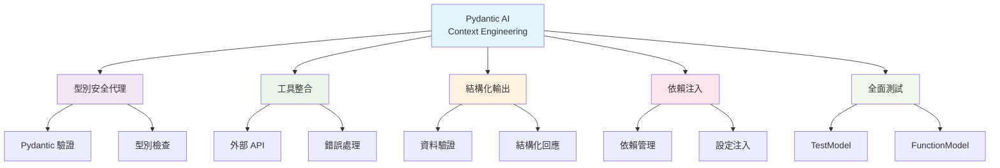
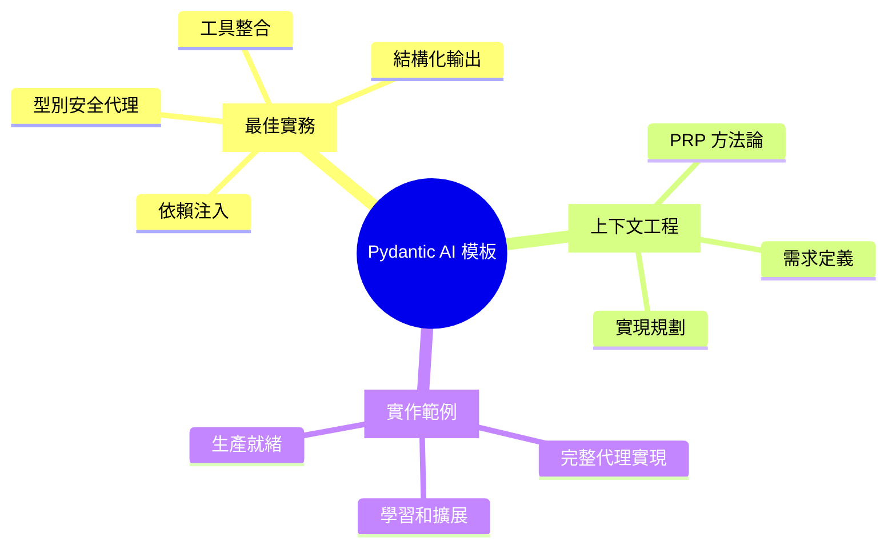
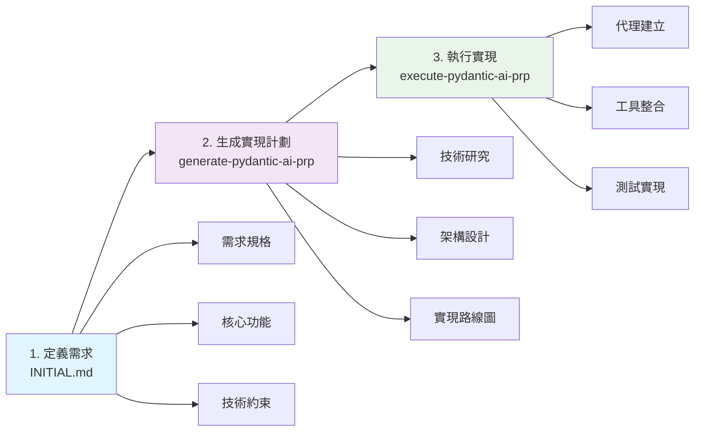
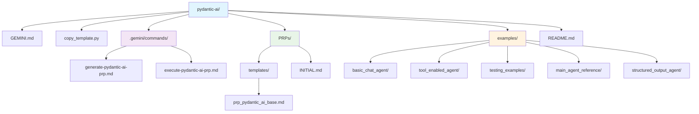
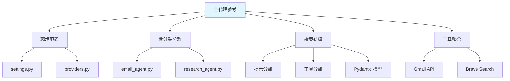
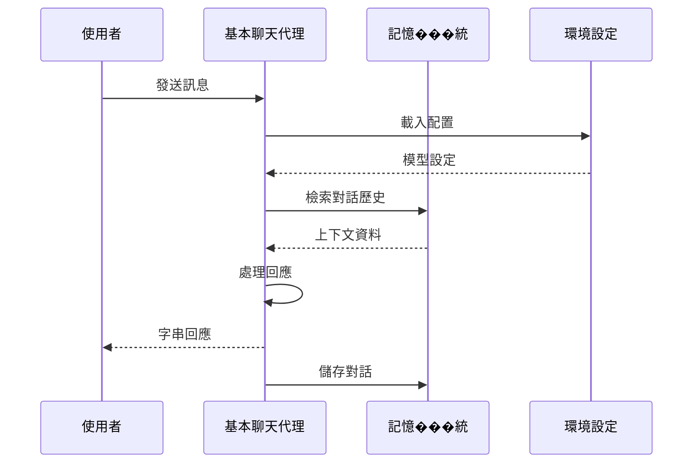
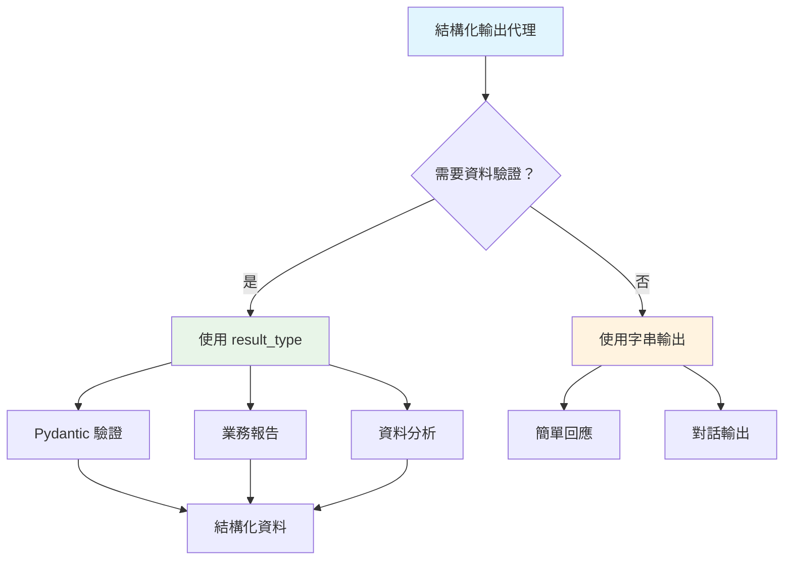
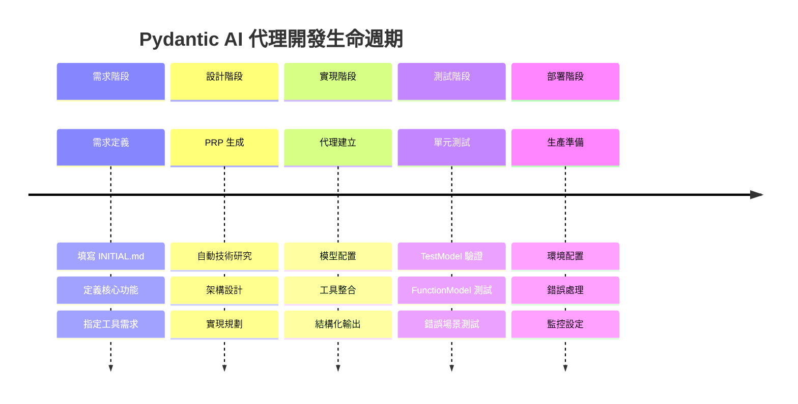
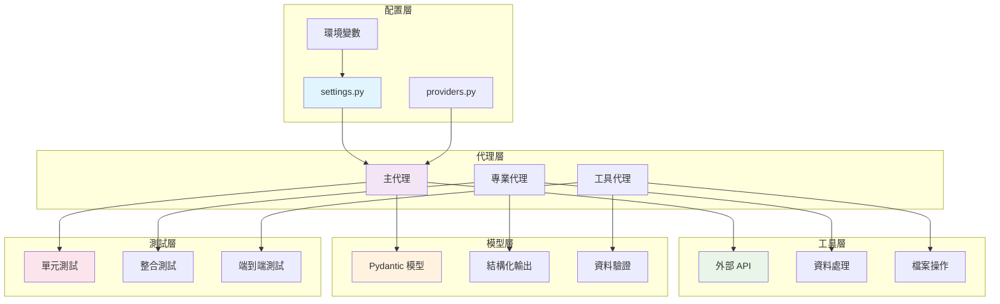
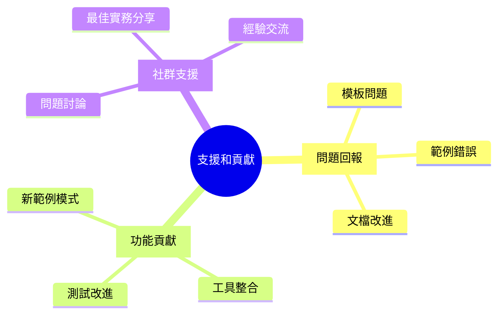

# Pydantic AI Context Engineering 模板

一個全面的模板，用於使用 Pydantic AI 結合上下文工程最佳實務、工具整合、結構化輸出和全面測試模式來建構生產級 AI 代理。



## 🚀 快速開始 - 複製模板

**2 分鐘內開始使用：**

```bash
# 複製上下文工程儲存庫
git clone https://github.com/coleam00/Context-Engineering-Intro.git
cd Context-Engineering-Intro/use-cases/pydantic-ai

# 1. 將此模板複製到您的新專案
python copy_template.py /path/to/my-agent-project

# 2. 導航到您的專案
cd /path/to/my-agent-project

# 3. 開始使用 PRP 工作流程建構
# 在 PRPs/INITIAL.md 中填寫您想要建立的代理

# 4. 根據您的詳細需求生成 PRP（生成後請驗證 PRP！）
/generate-pydantic-ai-prp PRPs/INITIAL.md

# 5. 執行 PRP 以建立您的 Pydantic AI 代理
/execute-pydantic-ai-prp PRPs/generated_prp.md
```

如果您不使用 Gemini Code，您可以簡單地告訴您的 AI 程式設計助手使用 .gemini/commands 中的 generate-pydantic-ai-prp 和 execute-pydantic-ai-prp 斜線指令作為提示。

## 📖 什麼是此模板？



此模板提供您建構複雜 Pydantic AI 代理所需的一切，使用經過驗證的上下文工程工作流程。它結合了：

- **Pydantic AI 最佳實務**：具有工具、結構化輸出和依賴注入的型別安全代理
- **上下文工程工作流程**：經過驗證的 PRP（產品需求提示）方法論
- **實作範例**：您可以學習和擴展的完整代理實現

## 🎯 PRP 框架工作流程



此模板使用 3 步驟上下文工程工作流程來建構 AI 代理：

### 1. **定義需求** (`PRPs/INITIAL.md`)
首先清楚定義您的代理需要做什麼：
```markdown
# 客戶支援代理 - 初始需求

## 概述
建構一個智慧客戶支援代理，可以處理查詢、
存取客戶資料，並適當地升級問題。

## 核心需求
- 具有上下文和記憶的多輪對話
- 客戶認證和帳戶存取
- 帳戶餘額和交易查詢
- 付款處理和退款處理
...
```

### 2. **生成實現計劃** 
```bash
/generate-pydantic-ai-prp PRPs/INITIAL.md
```
這會建立一個全面的「產品需求提示」文檔，包含：
- Pydantic AI 技術研究和最佳實務
- 具有工具和依賴性的代理架構設計
- 具有驗證循環的實現路線圖
- 安全模式和生產考量

### 3. **執行實現**
```bash
/execute-pydantic-ai-prp PRPs/your_agent.md
```
根據 PRP 實現完整代理，包含：
- 具有適當模型提供者配置的代理建立
- 具有錯誤處理和驗證的工具整合
- 具有 Pydantic 驗證的結構化輸出模型
- 使用 TestModel 和 FunctionModel 的全面測試

## 📂 模板結構



```
pydantic-ai/
├── GEMINI.md                           # Pydantic AI 全域開發規則
├── copy_template.py                    # 模板部署腳本
├── .gemini/commands/
│   ├── generate-pydantic-ai-prp.md     # 代理的 PRP 生成
│   └── execute-pydantic-ai-prp.md      # 代理的 PRP 執行
├── PRPs/
│   ├── templates/
│   │   └── prp_pydantic_ai_base.md     # 代理的基礎 PRP 模板
│   └── INITIAL.md                      # 範例代理需求
├── examples/
│   ├── basic_chat_agent/               # 簡單對話代理
│   │   ├── agent.py                    # 具有記憶和上下文的代理
│   │   └── README.md                   # 使用指南
│   ├── tool_enabled_agent/             # 具有外部工具的代理
│   │   ├── agent.py                    # 網頁搜尋 + 計算器工具
│   │   └── requirements.txt            # 依賴項
│   └── testing_examples/               # 全面測試模式
│       ├── test_agent_patterns.py      # TestModel、FunctionModel 範例
│       └── pytest.ini                  # 測試配置
└── README.md                           # 此檔案
```

## 🤖 包含的代理範例

### 1. 主代理參考 (`examples/main_agent_reference/`)



**標準參考實現**，展示適當的 Pydantic AI 模式：
- 使用 `settings.py` 和 `providers.py` 的環境基礎配置
- 電子郵件和研究代理之間的清晰關注點分離
- 適當的檔案結構，分離提示、工具、代理和 Pydantic 模型
- 與外部 API 的工具整合（Gmail、Brave Search）

**關鍵檔案：**
- `settings.py`：使用 pydantic-settings 的環境配置
- `providers.py`：使用 `get_llm_model()` 的模型提供者抽象
- `research_agent.py`：具有網頁搜尋和電子郵件整合的多工具代理
- `email_agent.py`：用於 Gmail 草稿建立的專業代理

### 2. 基本聊天代理 (`examples/basic_chat_agent/`)



展示核心模式的簡單對話代理：
- **環境基礎模型配置**（遵循 main_agent_reference）
- **預設字串輸出**（除非需要，否則無 `result_type`）
- 系統提示（靜態和動態）
- 具有依賴注入的對話記憶

**關鍵特色：**
- 簡單字串回應（非結構化輸出）
- 基於設定的配置模式
- 對話上下文追蹤
- 乾淨、最小化實現

### 3. 工具啟用代理 (`examples/tool_enabled_agent/`)

```mermaid
graph LR
    A[工具啟用代理] --> B[@agent.tool 裝飾器]
    A --> C[RunContext 注入]
    A --> D[錯誤處理]
    A --> E[重試機制]
    
    B --> B1[網頁搜尋工具]
    B --> B2[計算器工具]
    
    C --> C1[依賴注入]
    C --> C2[上下文管理]
    
    D --> D1[工具錯誤恢復]
    D --> D2[優雅降級]
    
    E --> E1[自動重試]
    E --> E2[指數退避]
    
    style A fill:#e1f5fe
```

具有工具整合能力的代��：
- **環境基礎配置**（遵循 main_agent_reference）
- **預設字串輸出**（無不必要結構）
- 網頁搜尋和計算工具
- 錯誤處理和重試機制

**關鍵特色：**
- `@agent.tool` 裝飾器模式
- 用於依賴注入的 RunContext
- 工具錯誤處理和恢復
- 工具的簡單字串回應

### 4. 結構化輸出代理 (`examples/structured_output_agent/`)



**新增**：展示何時使用 `result_type` 進行資料驗證：
- **環境基礎配置**（遵循 main_agent_reference）
- **具有 Pydantic 驗證的結構化輸出**（當特別需要時）
- 具有統計工具的資料分析
- 專業報告生成

**關鍵特色：**
- 展示 `result_type` 的適當使用
- 用於業務報告的 Pydantic 驗證
- 具有數值統計的資料分析工具
- 何時使用結構化與字串輸出的���楚文檔

### 5. 測試範例 (`examples/testing_examples/`)

```mermaid
graph TB
    A[測試範例] --> B[TestModel]
    A --> C[FunctionModel]
    A --> D[Agent.override()]
    A --> E[Pytest 夾具]
    
    B --> B1[快速開發驗證]
    B --> B2[無 API 成本]
    
    C --> C1[自訂行為測試]
    C --> C2[模擬回應]
    
    D --> D1[測試隔離]
    D --> D2[依賴注入模擬]
    
    E --> E1[異步測試]
    E --> E2[整合測試模式]
    
    style A fill:#e1f5fe
    style B fill:#e8f5e8
    style C fill:#f3e5f5
    style D fill:#fff3e0
    style E fill:#fce4ec
```

Pydantic AI 代理的全面測試模式：
- 用於快速開發驗證的 TestModel
- 用於自訂行為測試的 FunctionModel
- 用於測試隔離的 Agent.override()
- Pytest 夾具和異步測試

**關鍵特色：**
- 無 API 成本的單元測試
- 模擬依賴注入
- 工具驗證和錯誤場景測試
- 整合測試模式

## 📊 代理開發生命週期



## 🏗️ 架構最佳實務



## 📚 其他資源

- **官方 Pydantic AI 文檔**：https://ai.pydantic.dev/
- **上下文工程方法論**：參見主儲存庫 README

## 🆘 支援和貢獻



- **問題**：回報模板或範例的問題
- **改進**：貢獻額外範例或模式
- **問題**：詢問 Pydantic AI 整合或上下文工程

此模板是更大的上下文工程框架的一部分。查看主儲存庫以獲取更多上下文工程模板和方法論。

---

**準備建構生產級 AI 代理了嗎？** 從 `python copy_template.py my-agent-project` 開始，並遵循 PRP 工作流程！🚀

## 🔥 快速範例 - 建立第一個代理

讓我們用一個簡單範例來展示整個流程：

### 步驟 1：定義需求
```markdown
# 天氣助手代理 - INITIAL.md

## 概述
建立一個天氣查詢代理，可以獲取任何城市的當前天氣資訊。

## 核心需求
- 接受城市名稱輸入
- 調用天��� API 獲取資料
- 返回格式化的天氣資訊
- 處理無效城市名稱
```

### 步驟 2：生成和執行 PRP
```bash
# 生成詳細實現計劃
/generate-pydantic-ai-prp PRPs/INITIAL.md

# 執行實現
/execute-pydantic-ai-prp PRPs/weather_agent.md
```

### 步驟 3：獲得完整的生產就緒代理
```python
# 自動生成的代理包含：
# - 環境配置
# - 天氣 API 工具
# - 錯誤處理
# - 全面測試
# - 型別安全驗證
```

這就是 Context Engineering 的力量 - 從簡單需求到生產就緒代理，一切都自動化！

# Pydantic AI Context Engineering Template

A comprehensive template for building production-grade AI agents using Pydantic AI with context engineering best practices, tools integration, structured outputs, and comprehensive testing patterns.

## 🚀 Quick Start - Copy Template

**Get started in 2 minutes:**

```bash
# Clone the context engineering repository
git clone https://github.com/coleam00/Context-Engineering-Intro.git
cd Context-Engineering-Intro/use-cases/pydantic-ai

# 1. Copy this template to your new project
python copy_template.py /path/to/my-agent-project

# 2. Navigate to your project
cd /path/to/my-agent-project

# 3. Start building with the PRP workflow
# Fill out PRPs/INITIAL.md with the agent you want to create

# 4. Generate the PRP based on your detailed requirements (validate the PRP after generating!)
/generate-pydantic-ai-prp PRPs/INITIAL.md

# 5. Execute the PRP to create your Pydantic AI agent
/execute-pydantic-ai-prp PRPs/generated_prp.md
```

If you are not using Gemini Code, you can simply tell your AI coding assistant to use the generate-pydantic-ai-prp and execute-pydantic-ai-prp slash commands in .gemini/commands as prompts.

## 📖 What is This Template?

This template provides everything you need to build sophisticated Pydantic AI agents using proven context engineering workflows. It combines:

- **Pydantic AI Best Practices**: Type-safe agents with tools, structured outputs, and dependency injection
- **Context Engineering Workflows**: Proven PRP (Product Requirements Prompts) methodology
- **Working Examples**: Complete agent implementations you can learn from and extend

## 🎯 PRP Framework Workflow

This template uses a 3-step context engineering workflow for building AI agents:

### 1. **Define Requirements** (`PRPs/INITIAL.md`)
Start by clearly defining what your agent needs to do:
```markdown
# Customer Support Agent - Initial Requirements

## Overview
Build an intelligent customer support agent that can handle inquiries, 
access customer data, and escalate issues appropriately.

## Core Requirements
- Multi-turn conversations with context and memory
- Customer authentication and account access
- Account balance and transaction queries
- Payment processing and refund handling
...
```

### 2. **Generate Implementation Plan** 
```bash
/generate-pydantic-ai-prp PRPs/INITIAL.md
```
This creates a comprehensive 'Product Requirements Prompts' document that includes:
- Pydantic AI technology research and best practices
- Agent architecture design with tools and dependencies
- Implementation roadmap with validation loops
- Security patterns and production considerations

### 3. **Execute Implementation**
```bash
/execute-pydantic-ai-prp PRPs/your_agent.md
```
This implements the complete agent based on the PRP, including:
- Agent creation with proper model provider configuration
- Tool integration with error handling and validation
- Structured output models with Pydantic validation
- Comprehensive testing with TestModel and FunctionModel

## 📂 Template Structure

```
pydantic-ai/
├── GEMINI.md                           # Pydantic AI global development rules
├── copy_template.py                    # Template deployment script
├── .gemini/commands/
│   ├── generate-pydantic-ai-prp.md     # PRP generation for agents
│   └── execute-pydantic-ai-prp.md      # PRP execution for agents
├── PRPs/
│   ├── templates/
│   │   └── prp_pydantic_ai_base.md     # Base PRP template for agents
│   └── INITIAL.md                      # Example agent requirements
├── examples/
│   ├── basic_chat_agent/               # Simple conversational agent
│   │   ├── agent.py                    # Agent with memory and context
│   │   └── README.md                   # Usage guide
│   ├── tool_enabled_agent/             # Agent with external tools
│   │   ├── agent.py                    # Web search + calculator tools
│   │   └── requirements.txt            # Dependencies
│   └── testing_examples/               # Comprehensive testing patterns
│       ├── test_agent_patterns.py      # TestModel, FunctionModel examples
│       └── pytest.ini                  # Test configuration
└── README.md                           # This file
```

## 🤖 Agent Examples Included

### 1. Main Agent Reference (`examples/main_agent_reference/`)
**The canonical reference implementation** showing proper Pydantic AI patterns:
- Environment-based configuration with `settings.py` and `providers.py`
- Clean separation of concerns between email and research agents
- Proper file structure to separate prompts, tools, agents, and Pydantic models
- Tool integration with external APIs (Gmail, Brave Search)

**Key Files:**
- `settings.py`: Environment configuration with pydantic-settings
- `providers.py`: Model provider abstraction with `get_llm_model()`
- `research_agent.py`: Multi-tool agent with web search and email integration
- `email_agent.py`: Specialized agent for Gmail draft creation

### 2. Basic Chat Agent (`examples/basic_chat_agent/`)
A simple conversational agent demonstrating core patterns:
- **Environment-based model configuration** (follows main_agent_reference)
- **String output by default** (no `result_type` unless needed)
- System prompts (static and dynamic)
- Conversation memory with dependency injection

**Key Features:**
- Simple string responses (not structured output)
- Settings-based configuration pattern
- Conversation context tracking
- Clean, minimal implementation

### 3. Tool-Enabled Agent (`examples/tool_enabled_agent/`)
An agent with tool integration capabilities:
- **Environment-based configuration** (follows main_agent_reference)
- **String output by default** (no unnecessary structure)
- Web search and calculation tools
- Error handling and retry mechanisms

**Key Features:**
- `@agent.tool` decorator patterns
- RunContext for dependency injection
- Tool error handling and recovery
- Simple string responses from tools

### 4. Structured Output Agent (`examples/structured_output_agent/`)
**NEW**: Shows when to use `result_type` for data validation:
- **Environment-based configuration** (follows main_agent_reference)
- **Structured output with Pydantic validation** (when specifically needed)
- Data analysis with statistical tools
- Professional report generation

**Key Features:**
- Demonstrates proper use of `result_type`
- Pydantic validation for business reports
- Data analysis tools with numerical statistics
- Clear documentation on when to use structured vs string output

### 5. Testing Examples (`examples/testing_examples/`)
Comprehensive testing patterns for Pydantic AI agents:
- TestModel for rapid development validation
- FunctionModel for custom behavior testing
- Agent.override() for test isolation
- Pytest fixtures and async testing

**Key Features:**
- Unit testing without API costs
- Mock dependency injection
- Tool validation and error scenario testing
- Integration testing patterns

## 📚 Additional Resources

- **Official Pydantic AI Documentation**: https://ai.pydantic.dev/
- **Context Engineering Methodology**: See main repository README

## 🆘 Support & Contributing

- **Issues**: Report problems with the template or examples
- **Improvements**: Contribute additional examples or patterns
- **Questions**: Ask about Pydantic AI integration or context engineering

This template is part of the larger Context Engineering framework. See the main repository for more context engineering templates and methodologies.

---

**Ready to build production-grade AI agents?** Start with `python copy_template.py my-agent-project` and follow the PRP workflow! 🚀